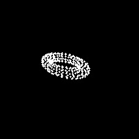
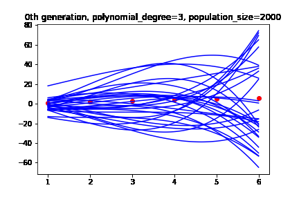
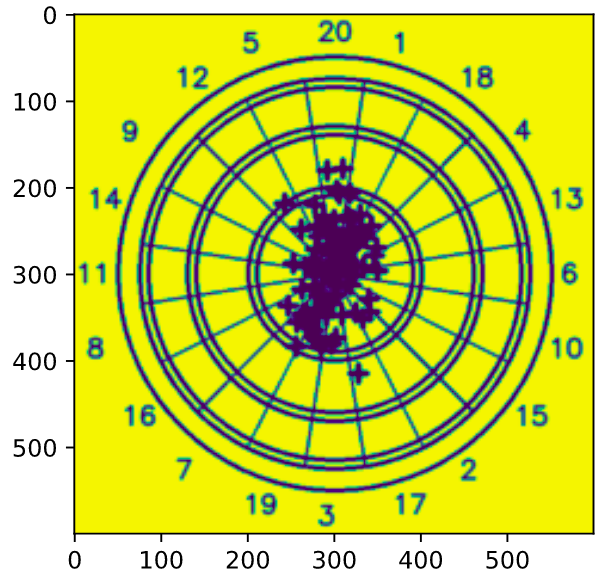
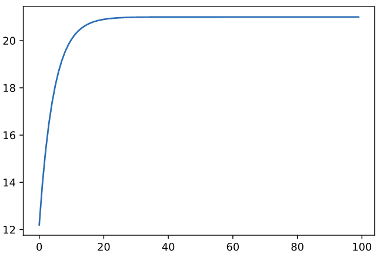

# fun_projects

Fun projects that are done in one evening:
- donut -> simple 3D rendering engine that renders 3D rotating donut
- pikado -> a simulation that using the standard deviation of your darts shots determines where to aim to achieve better score
- micrograd -> implementation of scalar optimization (inspired by pytorch)

 
 
 

